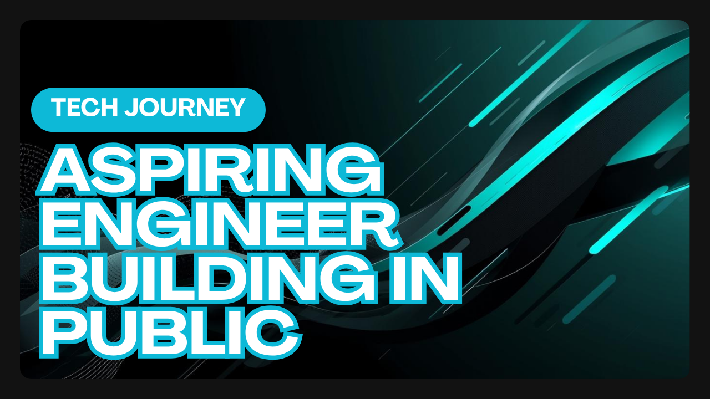

  

# 👋 Hi, I'm Bibhudendu Behera  

Python Engineer | Data Automation & ML | Building production-grade tools  
Portfolio: https://bibhu342.github.io/bibhu-portfolio/

---

## 🧰 Tech Stack & Tools

- 🐍 Python  
- 🐼 Pandas  
- 📊 NumPy  
- 🧮 SQL  
- 🧠 Machine Learning  
- 🤖 Generative AI  
- 📓 Jupyter Notebook  

---

## 📈 My Focus Areas

- 🌱 Strengthening Python, SQL & DSA foundations  
- 🧠 Building AI/ML project portfolio  
- 📊 Learning and applying GenAI tools  
- 💼 Preparing for interviews and freelancing  
- 🏆 Achieving my **Google AI Engineer** goal

---

## 📊 GitHub Stats

---

## 🌐 My Portfolio  
https://bibhu342.github.io/bibhu-portfolio/

Showcasing my production-grade automation tools, Python engineering work, and freelancing projects.

---

## 🌐 Connect With Me

  
📧 **Email:** bibhu342@gmail.com

⭐ *If you like my work, consider giving a star to my repositories — it keeps me motivated!*

---
